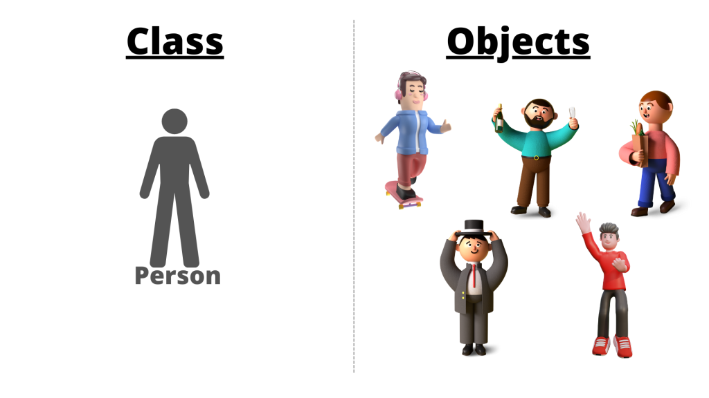
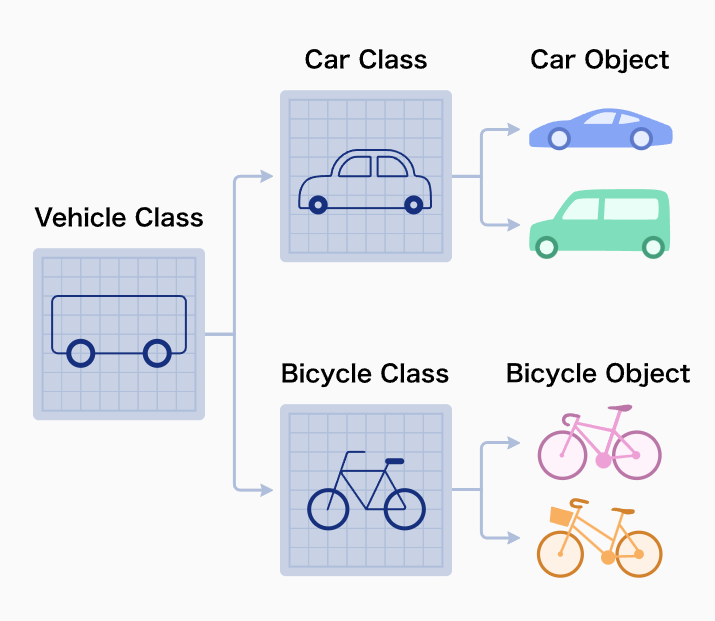
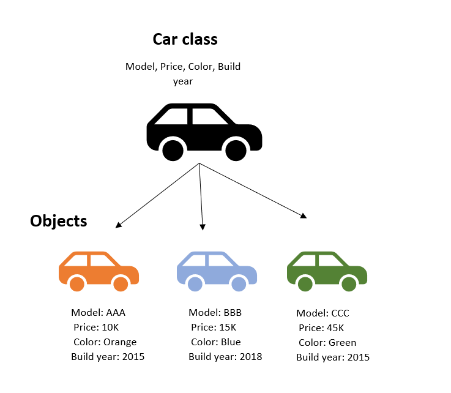
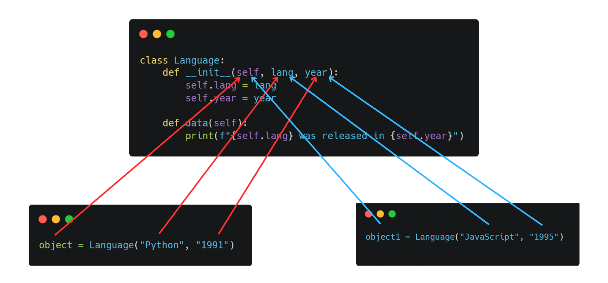
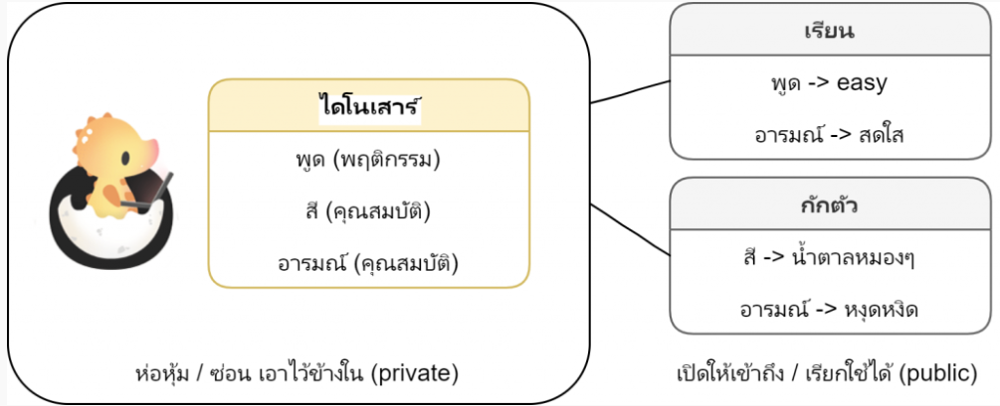
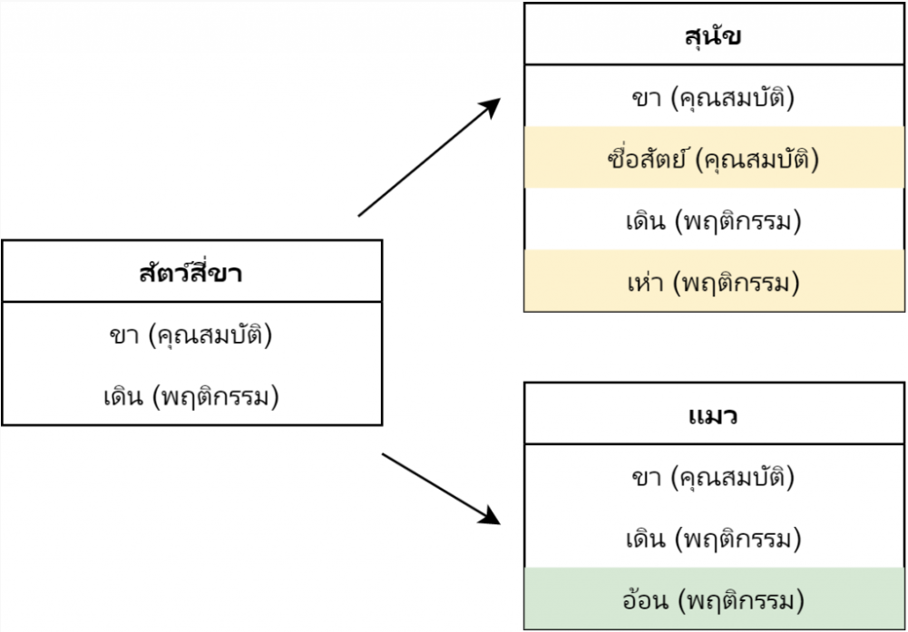
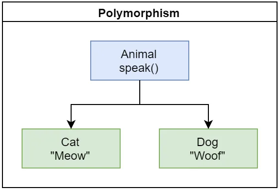

* [Python Comprehension](#python-comprehension)
* [Classes and Objects](#classes-and-objects)
* [Modules and Packages](#modules-and-packages)

## >Python Comprehension

### List Comprehension
List comprehension offers a shorter syntax when you want to create a new list based on the values of an existing list.

**Without list comprehension** you will have to write a **for** statement with a conditional test inside:
```
fruits = ["apple", "banana", "cherry", "kiwi", "mango"]
newlist = []

for x in fruits:
  if "a" in x:
    newlist.append(x)

print(newlist)

```
**With list comprehension** you can do all that with only one line of code:

```
fruits = ["apple", "banana", "cherry", "kiwi", "mango"]

newlist = [x for x in fruits if "a" in x]

print(newlist)
```
*newlist = [expression **for** item **in** iterable **if** condition == True]*

```
newlist = [x for x in fruits if x != "apple"]
print(newlist)
```
```
squares = [x**2 for x in range(10)]   
print(squares)
```

### Set Comprehension

```
sentence = "The cat in the hat had two sidekicks, thing one and thing two."

words = sentence.lower().replace('.', '').replace(',', '').split()

unique_words = {word for word in words}
# unique_words = {word for word in words if len(word) <= 3}

print(type(words))
print(unique_words)
```


### Nested Set Comprehensions

```
sentence = "The cat in the hat had two sidekicks, thing one and thing two."
words = sentence.lower().replace('.', '').replace(',', '').split()
vowels = ['a', 'e', 'i', 'o', 'u']

consonants1 = {frozenset({letter for letter in word if letter not in vowels}) for word in words}
consonants2 = {word for word in words}

print(consonants1)
print(consonants2)
```

```
# output

# consonants1
{'two', 'one', 'and', 'hat', 'in', 'the', 'had', 'thing', 'cat', 'sidekicks'}

# consonants2
{
    frozenset({'d', 'h'}), 
    frozenset({'w', 't'}), 
    frozenset({'h', 't'}), 
    frozenset({'n'}), 
    frozenset({'n', 'd'}), 
    frozenset({'n', 'g', 'h', 't'}), 
    frozenset({'c', 't'}), 
    frozenset({'s', 'd', 'k', 'c'})
    }
```

### Set Comprehension
Like **List Comprehension**, Python allows dictionary comprehensions. We can create dictionaries using simple expressions. A dictionary comprehension takes the form **{key: value for (key, value) in iterable}**

```
# Python code to demonstrate dictionary 
# comprehension
 
# Lists to represent keys and values
keys = ['a','b','c','d','e']
values = [1,2,3,4,5]  
 
# but this line shows dict comprehension here  
myDict = { k:v for (k,v) in zip(keys, values)}  
 
# We can use below too
# myDict = dict(zip(keys, values))  
 
print (myDict)
```

```
dic = dict.fromkeys(range(5), True)
 
print(dic)
```

### Using nested dictionary comprehension

```
# given string
l="GFG"
 
# using dictionary comprehension
dic = {
    x: {y: x + y for y in l} for x in l
}
 
print(dic)
```
---
---

## >Classes and Objects



**Objects** are an **encapsulation of variables and functions** into a single entity. Objects get their variables and functions from classes. **Classes** are essentially a **template to create your objects**.


     

     

     
### ค่อนข้างซับซ้อน ขออธิบายเป็นภาษาไทย 555

OOP เป็นวิธีการเขียนโปรแกรมรูปแบบหนึ่ง โดยมองสิ่งต่างๆในระบบเป็นวัตถุ (Object) ชิ้นหนึ่งที่มีหน้าที่และความหมายในตัว โดยวัตถุๆนั้น ก็มี คุณสมบัติ (Attributes) และ พฤติกรรม (Method,Behavior, Functionality) หรือการกระทำของมัน เป็นการมองบนพื้นฐานความเป็นจริงมากขึ้น


จากตัวอย่างรูปข้างบน
* Object คือ คน(Person) ประกอบไปด้วย 2 ส่วน
    * คุณสมบัติ(Attributes) ประกอบไปด้วย
        * Name
        * Age
        * Gender
        * Occupation
    * พฤติกรรม (Method, Behavior, Functionality) ซึ่งกอบประกอบไปด้วย
        * Walk()
        * Eat()
        * Sleep()
        * Work()

```
class Person:
    def __init__(self, name, age):
        self.name = name
        self.age = age

    def display_name(self):
        print(self.name, "is employee name")

A49_1 = Person("Nonny", 14)
A49_2 = Person("Lawrence", 12)

print(A49_1.name)
print(A49_2.age)

A49_1.display_name()

```

* `Person`  คือ ชื่อ Class (ขึ้นต้นด้วยตัวพิมพ์ใหญ่)
* `__init__()` คือ Method พิเศษเอาไว้ใช้สำหรับเริ่มต้น (Initialize) คลาส
* `display_name()`  คือ Method ในคำสั่งนี้ก็ทำเพียงแค่แสดงผลคำว่า "... is my name"
* `A49_1` และ  `A49_2` คือ Objects
* `A49_1.display_name()`  คือ การเรียกใช้ Method ของ Objects: `A49_1`

### What is`__init__( )` and `self` in Python ?
ในภาษา Python นั้น   `__init__()`  เป็น Method พิเศษ (Special or Dunder Method) หรือที่เรียกว่า Constructor ก็ได้เช่นกัน ซึ่ง  `__init__()`  จะถูกเรียกใช้โดยอัตโนมัติเมื่อมีการสร้างobjects ของคลาสขึ้นมา หรือเรียกได้ว่าจะเป็นส่วนของการเริ่มต้น (initialize) ของ class



Method  `__init__()` ใช้พารามิเตอร์ `self` ซึ่งเป็นการอ้างอิงถึงวัตถุที่กำลังสร้าง เพื่อให้สามารถเข้าถึงคุณสมบัติ (Attributes) และเมธอด (Methods) ของวัตถุ โดยพารามิเตอร์ `self`  ต้องเป็นพารามิเตอร์แรกในเมธอดที่กำหนดในคลาส ถึงแม้ว่าใน Python เราสามารถกำหนดพารามิเตอร์เป็นชื่ออะไรก็ได้ที่ไม่ใช่ `self` แต่สุดท้ายแล้วก็คือธรรมเนียมปฏิบัติ (convension) ของภาษาว่าควรต้องใช้ `self` ถึงจะเหมาะสมที่สุด

```
class Person:
    def __init__(self, name, age):
        self.name = name
        self.age = age
```

จากตัวอย่างด้านบนของ class `Person` จะเห็นว่าได้มีการประกาศพารามิเตอร์ 3 ตัว (รวม `self` ด้วย) นั่นก็คือ   `self`, `name` และ `age`

### Method 
Method คือฟังก์ชันที่อยู่ภายใน class โดยเมธอดจะเป็นตัวกำหนดการกระทำ (behavior) ของclass ถ้าสังเกตให้ดีจะเห็นว่า method ก็คือฟังก์ชัน ๆ หนึ่ง เพียงแต่ว่าเป็นฟังก์ชันที่อยู่ภายใต้ class นั่นเอง

```
class Person:
    def __init__(self, name, age):
        self.name = name
        self.age = age

    def display_name(self):
        print(self.name, "is employee name")

A49_1 = Person("Nonny", 14)
A49_1.display_name()
```
จากตัวอย่าง `A49_1.display_name()` จะเห็นว่าเราสามารถเข้าถึง **method** ของ **class** ได้

* `A49_1` คือ objects
* `displya_name()` คือ method


### สรุป
**1. Encapsulation (การห่อหุ้มข้อมูล)**
คือ วิธีการในการซ่อนข้อมูลหรือจำกัดการเข้าถึงข้อมูลบางอย่าง โดยหากต้องการเข้าถึงข้อมูลให้เข้าถึงผ่านทาง Methods หรือเราสามารถกำหนดระดับการเข้าถึงได้ ยกตัวอย่างเช่น public , private



**2. Inheritance (การสืบทอด)**
เป็นหลักการที่ คลาสแม่ (Super Class) สามารถสืบทอด Attributes และ Method ต่างๆ ไปยัง คลาสลูก (Sub Class) ได้ ซึ่ง คลาสลูกจะได้รับทุกอย่างจากคลาสแม่ และสามารถเพิ่มเติม Attributes หรือ Method เฉพาะตัวเข้าไปได้



**3. Polymorphism (การพ้องรูป)**
เป็นคุณสมบัติที่ว่า วัตถุใหม่ที่เกิดจากวัตถุแม่ชนิดเดียวกัน มีความสามารถเหมือนแม่แต่การผลลัพธ์การทำงานไม่เหมือนกัน โดยมีลักษณะเฉพาะตัว



**4. Abstraction (หลักการนามธรรม)**
คือ การแสดง Attributes และ Method ของ Object เท่าที่จำเป็น เรารู้แค่ว่า Method นี้ทำงานอย่างไรมี input parametes เป็นอย่างไร แต่ไม่จำเป็นที่ต้องรู้ถึงวิธีการทำงาน เช่น เครื่องชงกาแฟ เรารู้แค่ว่า ใส่เม็ดกาแฟ ,ใส่นม ,ใส่น้ำตาล แต่ไม่จำเป็นต้องรู้ว่าใช้น้ำกี่องศาหรือต้องบดกาแฟละเอียดเท่าไร

```
class Box:

    # shared variable for all object create by this class
    color = 'green'

    # class method for object
    def __init__(self, width, height, dept):
        self.width = width
        self.height = height
        self.dept = dept

     # class method for object
    def getVolume(self):
        return self.width * self.height * self.dept

    @staticmethod
    def compare(a, b):
        if a.getVolume() > b.getVolume():
            return 'greater than'
        elif a.getVolume() == b.getVolume():
            return 'equal'
        else:
            return 'less than'

a = Box(2, 3, 4)
b = Box(1, 2, 5)

Box.color = 'red'

print('Box a volume = %d' % a.getVolume())
print('Box b volume = %d' % b.getVolume())

print('Box a color = %s' % a.color)
print('Box b color = %s' % b.color)

print('Box a volume a is %s box b' % Box.compare(a, b))

```

---
---

## >Modules and Packages

In programming, a module is **a piece of software** that has a specific functionality.
**For example**, when building a ping pong game, one module may be responsible for the game logic, and another module draws the game on the screen. Each module consists of a different file, which may be edited separately.

### Writing modules
Modules in Python are just Python files with a **.py** extension. The name of the module is the same as the file name. A Python module can have a set of functions, classes, or variables defined and implemented. The example above includes two files:

**for example:**

```
mygame
├── game.py
└── draw.py
```
Output after run `game.py`

```
Screen initialized

Game started

Game result: Player won!

Screen cleared
```

The Python script `game.py` implements the game. It uses the function draw_game from the file `draw.py`, or in other words, the `draw` module that implements the logic for drawing the game on the screen.

The draw module may look something like this:
```
# draw.py

def draw_game():
    ...

def clear_screen(screen):
    ...
```

### Importing module

```
# game.py

import draw

...
...

```
